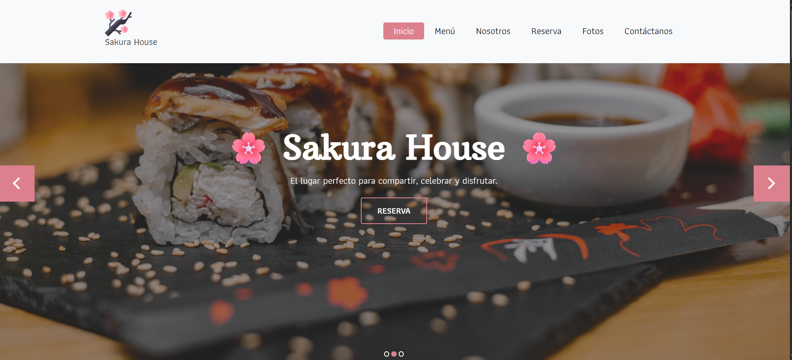
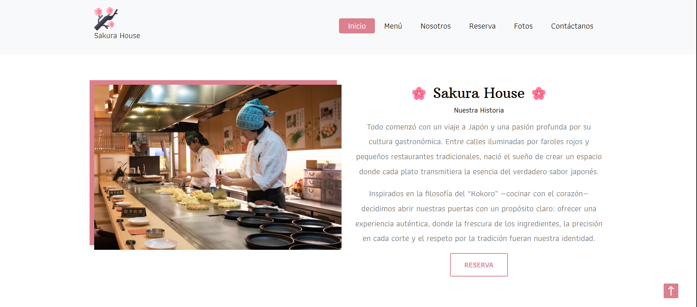
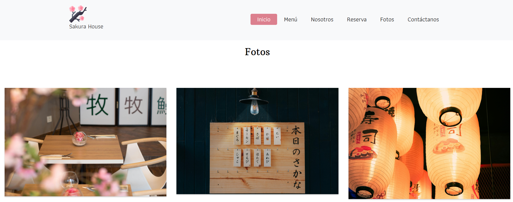
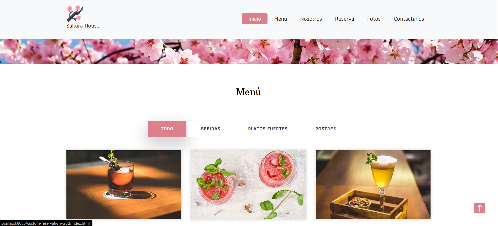
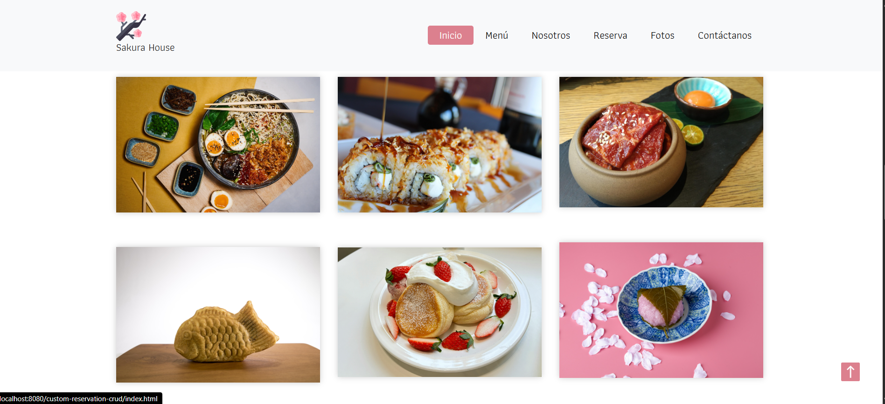
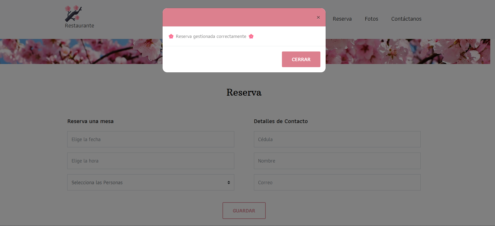

# 🌸 Restaurant CRUD - Sakura House

## 📌 Description
Restaurant CRUD is a web application developed using **PHP** and **MySQL**.  
It simulates a restaurant website with a fully functional backend connected to a database.

The system includes three main modules:

- 🍽️ Table Reservation Form
- 📩 Contact Message Form
- 📬 Newsletter Subscription Form

Each module is connected to its own database table and implements server-side validation.

---

## 🚀 Technologies Used

- PHP (PDO)
- MySQL
- HTML5
- CSS3
- Bootstrap
- JavaScript
- Git & GitHub

---

## 🗄️ Database Structure

The project includes three main tables:

1. **reservation**
2. **contact**
3. **subscription**

All forms are validated both on frontend and backend for better security.

---

## ✨ Features

- Email validation
- Prevention of duplicate subscriptions
- Modal feedback messages
- Date & time picker for reservations
- Server-side validation
- Clean and responsive design

---

## 📷 Screenshots

### 🏠 Home Page

### 🏠 About Us Page

### 🏠 Gallery Page

### 🏠 Menu Page

### 🍽️ Reservation Form

### 📩 Contact Form

## 👩🏻‍💻 Author

Luisa Camelo  
GitHub: https://github.com/LuisaCamelo
